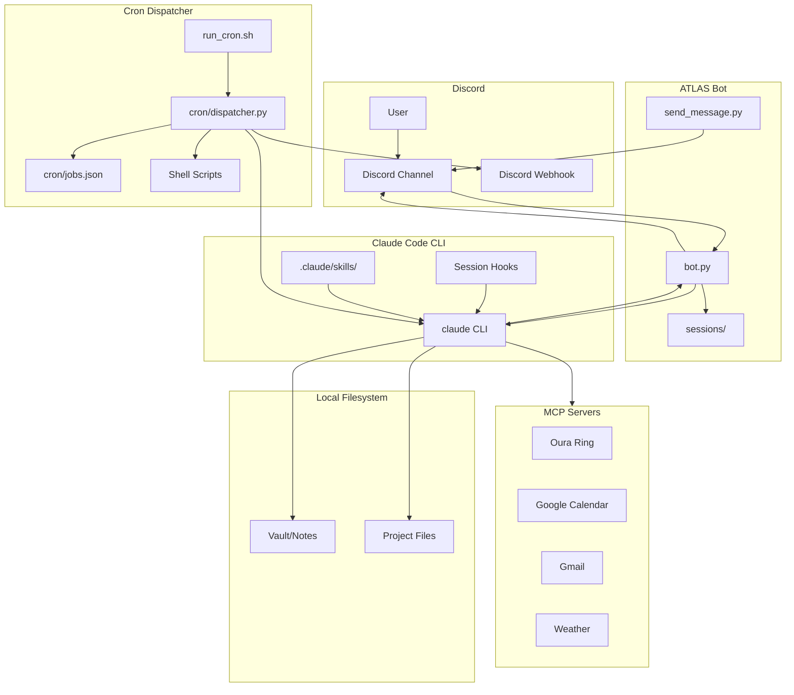
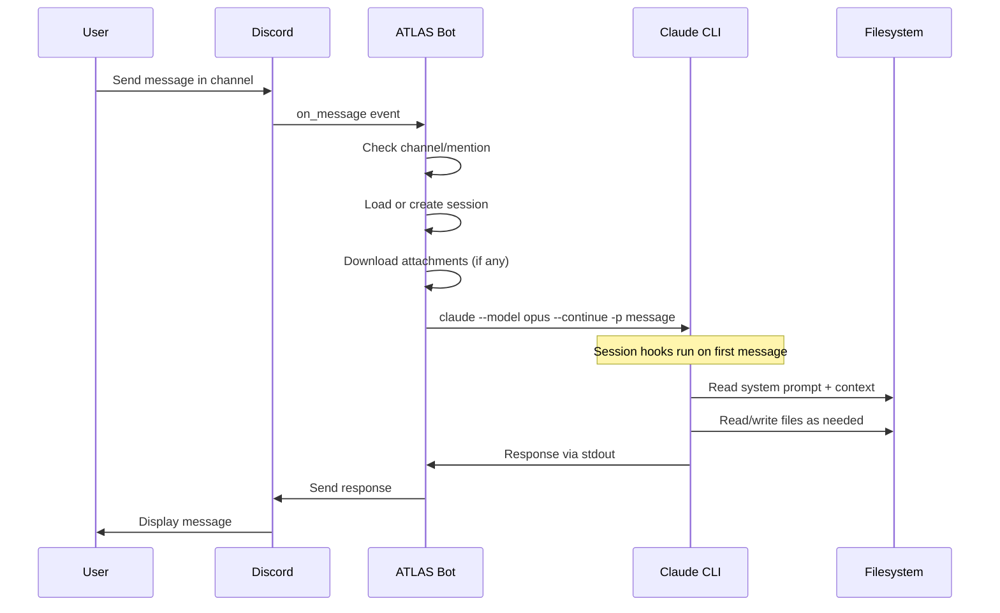
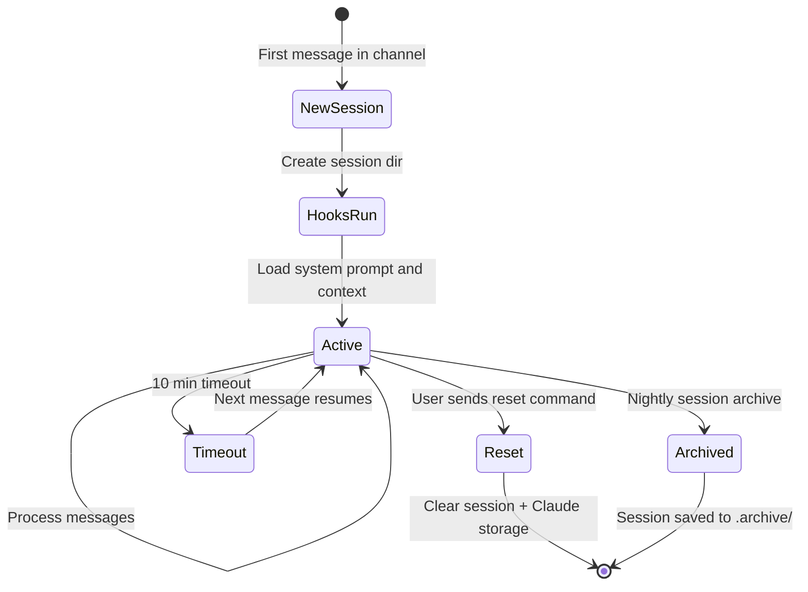
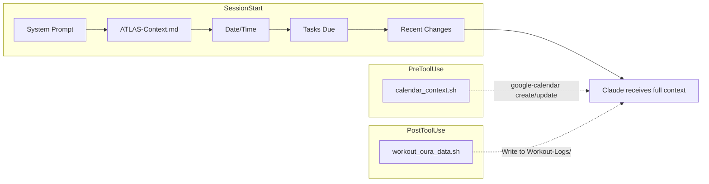
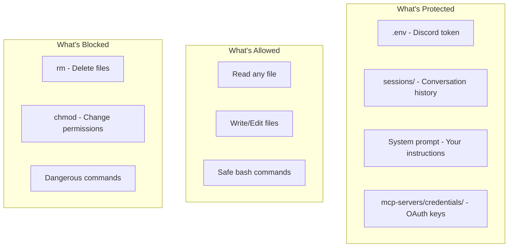

# ATLAS Bot

[](https://opensource.org/licenses/MIT)
[](https://www.python.org/downloads/)
[](https://github.com/astral-sh/ruff)
[](https://github.com/jamesmoon2/ATLAS-bot/actions/workflows/ci.yml)

A Discord bot that wraps [Claude Code CLI](https://github.com/anthropics/claude-code) for conversational AI assistance. Chat with Claude directly in Discord with full access to your local filesystem, scheduled automation, and MCP integrations.

## Architecture



## Message Flow



## Session Lifecycle



## Features

| Feature | Description |
| --- | --- |
| **Session Continuity** | Maintains conversation context using `--continue` across messages |
| **Channel Isolation** | Each Discord channel gets its own Claude session and model preference |
| **Configurable Hooks** | Three hook types: SessionStart, PreToolUse, PostToolUse |
| **Model Switching** | Switch between opus and sonnet per channel (`!model opus\|sonnet`) |
| **Attachment Support** | Upload images and PDFs to Discord; Claude reads them via the Read tool |
| **Scheduled Automation** | 12 cron jobs: briefings, reminders, archival, health checks, and more |
| **MCP Integrations** | Oura Ring, Google Calendar, Gmail, and Weather data via MCP servers |
| **Claude Skills** | 6 reusable skills for morning briefings, workout logging, training plans |
| **Medication Tracking** | Cron reminders with checkmark reaction logging to vault files |
| **Nightly Session Archive** | Sessions archived and reset daily to keep context fresh |
| **Tool Access** | Pre-approved tools: Read, Write, Edit, Glob, Grep, Bash (safe subset) |
| **Timeout Protection** | 10-minute timeout for long-running requests |

## Requirements

- Python 3.10+
- [Claude Code CLI](https://github.com/anthropics/claude-code) installed and authenticated
- Discord Bot Token

## Quick Start

```bash
# Clone
git clone https://github.com/jamesmoon2/ATLAS-bot.git
cd atlas-bot

# Setup
python -m venv venv
source venv/bin/activate
pip install -r requirements.txt

# Configure
cp .env.example .env
# Edit .env with your values

# Run
python bot.py
```

## Configuration

### Environment Variables

| Variable | Description | Required |
| --- | --- | --- |
| `DISCORD_TOKEN` | Discord bot token | Yes |
| `VAULT_PATH` | Path to your notes/vault directory | Yes |
| `SESSIONS_DIR` | Where to store session data | No |
| `BOT_DIR` | Bot installation directory | No |
| `SYSTEM_PROMPT_PATH` | Path to system prompt file | No |
| `CONTEXT_PATH` | Path to persistent context file (ATLAS-Context.md) | No |
| `TASKS_FILE_PATH` | Path to tasks file for hook injection | No |
| `DISCORD_CHANNEL_ID` | Channel ID for `send_message.py` and cron jobs | No |
| `DISCORD_WEBHOOK_URL` | Webhook URL for cron job notifications | No |

### File Structure

```
atlas-bot/
├── bot.py                    # Main Discord bot
├── send_message.py           # Send messages to Discord programmatically
├── run_cron.sh               # Cron entry point (called every minute)
├── cron/
│   ├── dispatcher.py         # Job scheduler and executor
│   ├── jobs.json             # Job definitions (schedules, prompts, tools)
│   ├── state/
│   │   └── last_runs.json    # Tracks last run times to prevent duplicates
│   ├── context_drift.sh      # Weekly context consistency check
│   ├── daily_summary.sh      # End-of-day summary generator
│   ├── med_reminder.sh       # Medication reminder via webhook
│   ├── session_archive.sh    # Nightly session archive and reset
│   └── task_triage.sh        # Task prioritization helper
├── hooks/
│   ├── tasks_summary.sh      # SessionStart: inject due tasks
│   ├── recent_changes.sh     # SessionStart: inject recent file changes
│   ├── recent_summaries.sh   # Recent daily summary context
│   ├── calendar_context.sh   # PreToolUse: 7-day calendar for event creation
│   └── workout_oura_data.sh  # PostToolUse: fetch Oura data after workout log
├── mcp-servers/
│   ├── oura/                 # Custom Oura Ring MCP server
│   │   ├── mcp_server.py
│   │   └── README.md
│   └── credentials/          # OAuth credentials (gitignored)
├── .claude/
│   └── skills/               # Reusable Claude skill definitions
│       ├── morning-briefing.md
│       ├── daily-summary.md
│       ├── log-workout.md
│       ├── log-cardio.md
│       ├── log-medication.md
│       └── weekly-training-planner.md
├── etc/
│   ├── systemd/
│   │   └── atlas-bot.service  # systemd unit file
│   └── logrotate.d/
│       └── atlas-bot          # Log rotation config
├── sessions/                  # Per-channel session data (gitignored)
│   └── {channel_id}/
│       ├── .claude/
│       │   ├── settings.json        # Hooks config
│       │   └── settings.local.json  # Permissions
│       ├── attachments/             # Downloaded Discord attachments
│       └── model.txt                # Channel model preference
├── logs/
│   └── cron/                  # Per-job log files (gitignored)
└── .env                       # Your configuration (gitignored)
```

### Hooks System



Hooks are defined in `bot.py` `CHANNEL_SETTINGS` and run at different stages:

**SessionStart** -- Runs on first message in a new session:

1. **System Prompt** -- Custom instructions for Claude
2. **Persistent Context** -- `ATLAS-Context.md` with stable facts, active threads, preferences
3. **Date/Time** -- Current date and time for temporal awareness
4. **Tasks Summary** -- Overdue and due-today items from your vault
5. **Recent Changes** -- Files modified in the last 24 hours

**PreToolUse** -- Runs before specific tool calls:

- `calendar_context.sh` -- Triggered before `google-calendar create-event` or `update-event`. Injects a 7-day ISO date table so Claude schedules events on the correct dates.

**PostToolUse** -- Runs after specific tool calls:

- `workout_oura_data.sh` -- Triggered after writing to `Workout-Logs/20*.md`. Fetches Oura recovery data to add context to the workout log.

## Usage

### Triggering the Bot

The bot responds to:

- Any message in a channel named `#atlas`
- Direct @mentions in any channel

### Commands

| Command | Description |
| --- | --- |
| `!help` | Show available commands |
| `!model` | Show current model (opus or sonnet) |
| `!model sonnet\|opus` | Switch model for this channel |
| `!reset` / `!clear` | Reset the current channel's session |

### Example Conversation

```
You: What tasks do I have due today?

ATLAS: Based on your vault, here are your tasks due today:
- [ ] Review PR for auth changes 📅 2026-02-14
- [ ] Send weekly update email 📅 2026-02-14

You: Mark the first one as done

ATLAS: I've updated the task in your vault:
- [x] Review PR for auth changes 📅 2026-02-14 ✅
```

## Scheduled Jobs

The cron dispatcher (`cron/dispatcher.py`) runs every minute via `run_cron.sh` and executes jobs defined in `cron/jobs.json`. Jobs can run Claude with specific models, tools, and prompts, or execute shell scripts directly.

| Job | Schedule | Description |
| --- | --- | --- |
| Morning Briefing | 5:30 AM daily | Weather, calendar, training plan, medications, recovery |
| Daily Summary | 11:55 PM daily | End-of-day review, context file updates |
| Session Archive | 11:59 PM daily | Archive session data, reset for next day |
| Weekly Training Planner | 12:00 PM Sun | Plan next week's training based on recovery and calendar |
| MCP Health Check | 6:00 AM Mon | Validate OAuth tokens for Calendar and Gmail |
| Stale Project Detector | 8:00 AM Sat | Scan vault for projects untouched 30+ days |
| Context Drift Detector | 8:00 AM Sun | Check ATLAS-Context.md for consistency |
| Oura Context Update | 10:00 AM daily | Backfill Oura data into workout logs |
| Medication Reminder (Mon AM) | 5:00 AM Mon | Medication reminder via webhook |
| Medication Reminder (Wed AM) | 5:00 AM Wed | Medication reminder via webhook |
| Medication Reminder (Thu PM) | 8:00 PM Thu | Medication reminder via webhook |
| Medication Reminder (Sat PM) | 8:00 PM Sat | Medication reminder via webhook |

All times are in `America/Los_Angeles`. The dispatcher tracks last run times in `cron/state/last_runs.json` to prevent duplicate executions. Use `--run-now JOB_ID` to manually trigger a job.

Setup:

1. Create a Discord webhook in your channel
2. Add `DISCORD_WEBHOOK_URL` to `.env`
3. Add system crontab entry: `* * * * * /path/to/atlas-bot/run_cron.sh`

## MCP Integrations

| Server | Purpose |
| --- | --- |
| **Oura Ring** | Sleep, readiness, activity, HRV, and stress data (`mcp-servers/oura/`) |
| **Google Calendar** | Event creation, listing, free/busy queries, scheduling |
| **Gmail** | Email search, reading, sending, label and filter management |
| **Weather** | Forecasts, current conditions, and alerts (NOAA + Open-Meteo) |

See [`mcp-servers/oura/README.md`](mcp-servers/oura/README.md) for Oura server setup.

## Skills

Reusable skill definitions in `.claude/skills/` that Claude can invoke via the Skill tool:

| Skill | Description |
| --- | --- |
| `morning-briefing` | Daily briefing with weather, schedule, training, medications, recovery |
| `daily-summary` | End-of-day review of activities and structured summary |
| `log-workout` | Parse freeform workout reports into structured vault logs |
| `log-cardio` | Parse freeform cardio session reports into structured logs |
| `log-medication` | Parse medication reports and log doses with validation |
| `weekly-training-planner` | Weekly training plan based on recovery, performance, and schedule |

## Development

```bash
# Install dev dependencies
pip install -e ".[dev]"

# Set up pre-commit hooks
pre-commit install

# Run linter
ruff check .

# Format code
ruff format .
```

### Pre-commit Hooks

- **Ruff** - Python linting and formatting
- **Prettier** - Markdown, JSON, YAML formatting
- **Standard hooks** - Trailing whitespace, merge conflicts, etc.

## Security Considerations



- **Credentials** are stored in `.env` (gitignored)
- **Sessions** contain conversation history (gitignored)
- **OAuth keys** in `mcp-servers/credentials/` (gitignored)
- **Tool permissions** are pre-configured in `CHANNEL_PERMISSIONS`
- **Dangerous commands** like `rm`, `chmod` are not in the allow list

## Roadmap

- [ ] Real-time streaming status updates
- [ ] Interactive permission prompts via Discord buttons
- [ ] Multi-project channel mapping
- [x] Model switching (`!model sonnet|opus`)

## License

MIT

---

Built with [Claude Code](https://github.com/anthropics/claude-code)
