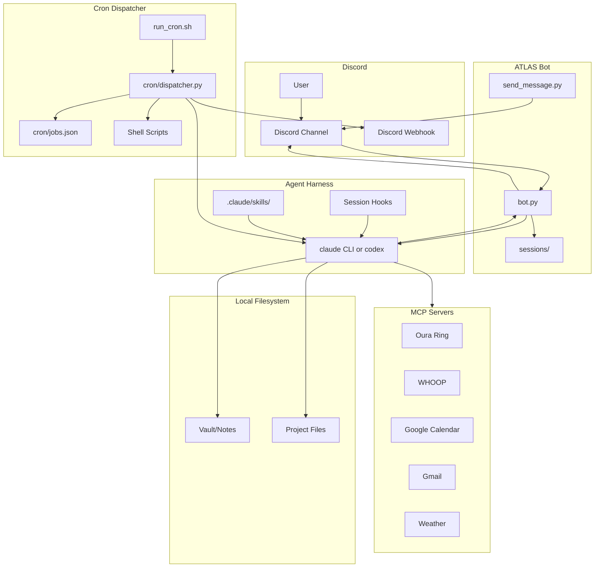
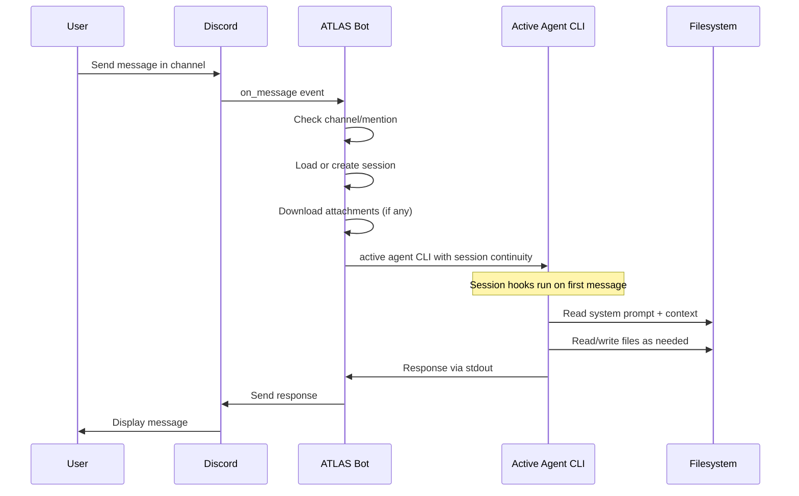
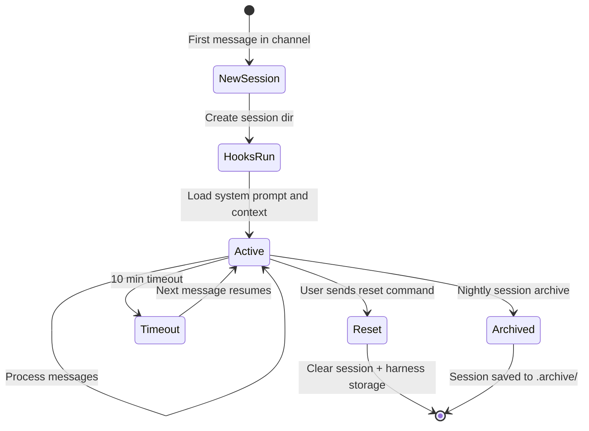
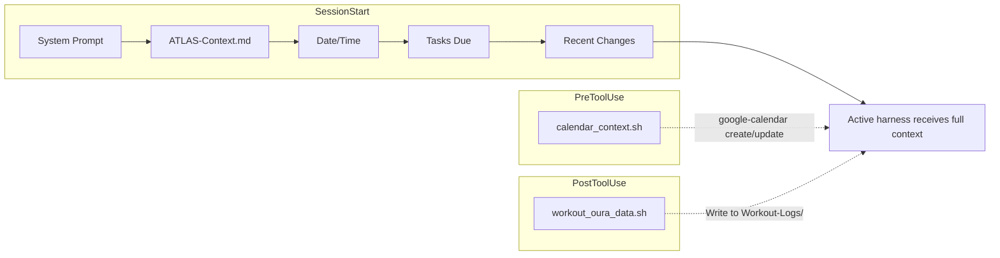
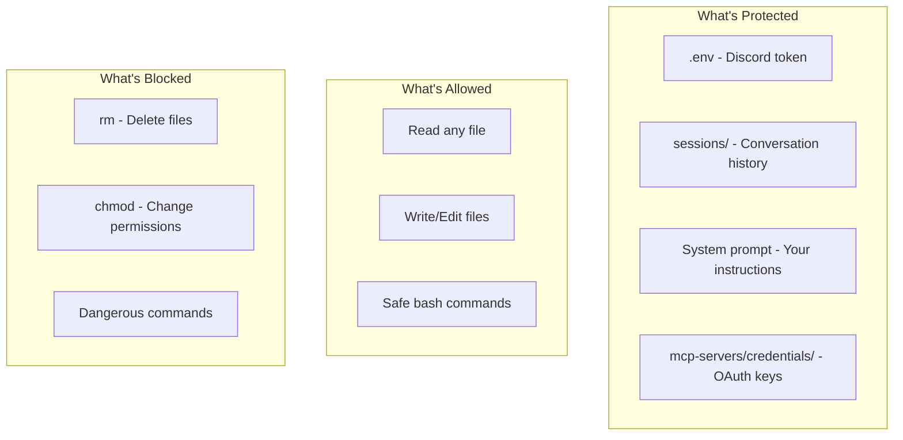

# ATLAS Bot

[](https://opensource.org/licenses/MIT)
[](https://www.python.org/downloads/)
[](https://github.com/astral-sh/ruff)
[](https://github.com/jamesmoon2/ATLAS-bot/actions/workflows/ci.yml)

A Discord bot that wraps a configurable agent harness for conversational AI assistance. ATLAS can run on [Claude Code CLI](https://github.com/anthropics/claude-code) or OpenAI Codex while keeping the same prompts, skills, hooks, scheduled automation, and Discord interaction model.

## Architecture


```mermaid
flowchart TB
    subgraph Discord
        User[User]
        Channel[Discord Channel]
        Webhook[Discord Webhook]
    end

    subgraph ATLAS[ATLAS Bot]
        Bot[bot.py]
        Sessions[sessions/]
        SendMsg[send_message.py]
    end

    subgraph Cron[Cron Dispatcher]
        RunCron[run_cron.sh]
        Dispatcher[cron/dispatcher.py]
        Jobs[cron/jobs.json]
        Scripts[Shell Scripts]
    end

    subgraph CLI[Agent Harness]
        Agent[claude CLI or codex]
        Hooks[Session Hooks]
        Skills[.claude/skills/]
    end

    subgraph MCP[MCP Servers]
        Oura[Oura Ring]
        Whoop[WHOOP]
        Calendar[Google Calendar]
        Gmail[Gmail]
        Weather[Weather]
    end

    subgraph FS[Local Filesystem]
        Vault[Vault/Notes]
        Files[Project Files]
    end

    User --> Channel
    Channel --> Bot
    Bot --> Agent
    Bot --> Sessions
    Agent --> Vault
    Agent --> Files
    Agent --> MCP
    Hooks --> Agent
    Skills --> Agent
    Agent --> Bot
    Bot --> Channel
    RunCron --> Dispatcher
    Dispatcher --> Jobs
    Dispatcher --> Agent
    Dispatcher --> Scripts
    Dispatcher --> Webhook
    SendMsg --> Channel
```

## Message Flow


```mermaid
sequenceDiagram
    participant U as User
    participant D as Discord
    participant B as ATLAS Bot
    participant C as Active Agent CLI
    participant F as Filesystem

    U->>D: Send message in channel
    D->>B: on_message event
    B->>B: Check channel/mention
    B->>B: Load or create session
    B->>B: Download attachments (if any)
    B->>C: active agent CLI with session continuity

    Note over C: Session hooks run on first message
    C->>F: Read system prompt + context
    C->>F: Read/write files as needed
    C->>B: Response via stdout
    B->>D: Send response
    D->>U: Display message
```

## Session Lifecycle


```mermaid
stateDiagram-v2
    [*] --> NewSession: First message in channel

    NewSession --> HooksRun: Create session dir
    HooksRun --> Active: Load system prompt and context

    Active --> Active: Process messages
    Active --> Reset: User sends reset command
    Active --> Timeout: 10 min timeout
    Active --> Archived: Nightly session archive

    Reset --> [*]: Clear session + harness storage
    Timeout --> Active: Next message resumes
    Archived --> [*]: Session saved to .archive/
```

## Features

| Feature                     | Description                                                                                    |
| --------------------------- | ---------------------------------------------------------------------------------------------- |
| **Session Continuity**      | Maintains conversation context across messages                                                 |
| **Channel Isolation**       | Each Discord channel gets its own agent session and model preference                           |
| **Configurable Hooks**      | Three hook types: `SessionStart`, `PreToolUse`, `PostToolUse`                                  |
| **Provider Switching**      | Switch the harness globally with `ATLAS_AGENT_PROVIDER=claude` or `ATLAS_AGENT_PROVIDER=codex` |
| **Model Switching**         | Switch models per channel based on the active provider                                         |
| **Attachment Support**      | Upload images and PDFs to Discord; the active harness reads them from the session directory    |
| **Scheduled Automation**    | 12 cron jobs: briefings, reminders, archival, health checks, and more                          |
| **MCP Integrations**        | Oura Ring, WHOOP, Google Calendar, Gmail, and Weather data via MCP servers                     |
| **ATLAS Skills**            | Reusable skills for briefings, workout logging, training plans, health monitoring, and reviews |
| **Second Brain Librarian**  | Vault indexing, note recall, open-loop review, orphan-note detection, and twice-weekly digests |
| **Medication Tracking**     | Config-driven cron reminders (`meds.json`) with checkmark reaction logging to vault files      |
| **Nightly Session Archive** | Sessions archived and reset daily to keep context fresh                                        |
| **Tool Access**             | Pre-approved tools: Read, Write, Edit, Glob, Grep, Bash (safe subset)                          |
| **Timeout Protection**      | 10-minute timeout for long-running requests                                                    |

## Requirements

- Python 3.10+
- One configured harness:
  - [Claude Code CLI](https://github.com/anthropics/claude-code), or
  - OpenAI Codex CLI
- Discord Bot Token

## Quick Start

```bash
# Clone
git clone https://github.com/jamesmoon2/ATLAS-bot.git
cd atlas-bot

# Setup
python -m venv venv
source venv/bin/activate
pip install -e ".[dev]"

# Configure
cp .env.example .env
# Edit .env with your values

# Run
python bot.py
```

## Configuration

### Environment Variables

| Variable                              | Description                                                      | Required |
| ------------------------------------- | ---------------------------------------------------------------- | -------- |
| `DISCORD_TOKEN`                       | Discord bot token                                                | Yes      |
| `VAULT_PATH`                          | Path to your notes/vault directory                               | Yes      |
| `SESSIONS_DIR`                        | Where to store session data                                      | No       |
| `BOT_DIR`                             | Bot installation directory                                       | No       |
| `SYSTEM_PROMPT_PATH`                  | Path to system prompt file                                       | No       |
| `CONTEXT_PATH`                        | Path to persistent context file (ATLAS-Context.md)               | No       |
| `TASKS_FILE_PATH`                     | Path to tasks file for hook injection                            | No       |
| `ATLAS_AGENT_PROVIDER`                | Active harness: `claude` or `codex`                              | No       |
| `ATLAS_CLAUDE_MODEL`                  | Default Claude model for new channels                            | No       |
| `ATLAS_CODEX_MODEL`                   | Default Codex model for new channels                             | No       |
| `ATLAS_CODEX_REASONING_EFFORT`        | Codex reasoning effort (`low`..`xhigh`)                          | No       |
| `ATLAS_CODEX_HOME`                    | Optional bot-specific Codex profile/home                         | No       |
| `ATLAS_CODEX_CRON_TIMEOUT_MULTIPLIER` | Multiplier for agent cron job timeouts under Codex (default `3`) | No       |
| `DISCORD_CHANNEL_ID`                  | Channel ID for `send_message.py` and cron jobs                   | No       |
| `DISCORD_WEBHOOK_URL`                 | Webhook URL for cron job notifications                           | No       |

### Provider Switching

ATLAS can run on either Claude or Codex. The active provider is controlled by `ATLAS_AGENT_PROVIDER` in `.env`.

Common commands:

```bash
# Restart both services from the repo
./restart_atlas_services.sh

# Switch provider and restart immediately
./set_atlas_provider.sh codex
./set_atlas_provider.sh claude

# Change provider without restarting yet
./set_atlas_provider.sh codex --no-restart
```

Operational notes:

- Default behavior remains Claude. Leave `ATLAS_AGENT_PROVIDER=claude` for the original setup.
- `./set_atlas_provider.sh codex` switches to Codex, updates `.env`, and restarts `atlas-bot.service` and `cron.service`.
- `./set_atlas_provider.sh claude` does the inverse for a fast rollback.
- If you want Codex isolated from your personal CLI state, set `ATLAS_CODEX_HOME` to a bot-specific directory.
- A short operator guide lives in [PROVIDER_SWITCH_USER_GUIDE.md](./PROVIDER_SWITCH_USER_GUIDE.md).

### File Structure

```
atlas-bot/
├── bot.py                    # Main Discord bot
├── garmin_workout_fallback.py # Repo-native Garmin workout lookup fallback
├── med_config.py             # Shared medication config loader
├── meds.json                 # Medication config (gitignored — personal health data)
├── meds.json.example         # Sanitized example config
├── send_message.py           # Send messages to Discord programmatically
├── run_cron.sh               # Cron entry point (called every minute)
├── cron/
│   ├── dispatcher.py         # Job scheduler and executor
│   ├── jobs.json             # Job definitions (schedules, prompts, tools)
│   ├── state/
│   │   └── last_runs.json    # Tracks last run times to prevent duplicates
│   ├── context_drift.sh      # Weekly context consistency check
│   ├── daily_summary.sh      # End-of-day summary generator
│   ├── med_reminder.sh       # Medication reminder via webhook
│   ├── session_archive.sh    # Nightly session archive and reset
│   ├── task_triage.sh        # Task prioritization helper
│   └── vault_index.py        # Builds machine-readable vault index
├── hooks/
│   ├── tasks_summary.sh      # SessionStart: inject due tasks
│   ├── recent_changes.sh     # SessionStart: inject recent file changes
│   ├── recent_summaries.sh   # Recent daily summary context
│   ├── librarian_context.sh  # SessionStart: inject compact vault snapshot
│   ├── calendar_context.sh   # PreToolUse: 7-day calendar for event creation
│   └── workout_oura_data.sh  # PostToolUse: fetch Oura + WHOOP data after workout log
├── mcp-servers/
│   ├── oura/                 # Custom Oura Ring MCP server
│   │   ├── mcp_server.py
│   │   └── README.md
│   ├── garmin/              # Repo-managed Garmin Connect MCP server
│   │   ├── mcp_server.py
│   │   └── README.md
│   ├── whoop/                # Repo-managed WHOOP MCP server
│   │   ├── mcp_server.py
│   │   └── README.md
│   └── credentials/          # OAuth credentials (gitignored)
├── .claude/
│   └── skills/               # Reusable ATLAS skill definitions
│       ├── morning-briefing.md
│       ├── daily-summary.md
│       ├── health-pattern-monitor.md
│       ├── log-workout.md
│       ├── log-cardio.md
│       ├── log-medication.md
│       ├── second-brain-librarian.md
│       ├── weekly-review.md
│       └── weekly-training-planner.md
├── etc/
│   ├── systemd/
│   │   └── atlas-bot.service  # systemd unit file
│   └── logrotate.d/
│       └── atlas-bot          # Log rotation config
├── sessions/                  # Per-channel session data (gitignored)
│   └── {channel_id}/
│       ├── .claude/
│       │   ├── settings.json        # Harness session hooks config
│       │   └── settings.local.json  # Harness permissions
│       ├── AGENTS.md                # Generated Codex session instructions when Codex is active
│       ├── ATLAS-Garmin-Workout-Helper.md  # Garmin MCP/fallback instructions
│       ├── attachments/             # Downloaded Discord attachments
│       └── model.txt                # Channel model preference
├── logs/
│   └── cron/                  # Per-job log files (gitignored)
└── .env                       # Your configuration (gitignored)
```

### Hooks System


```mermaid
flowchart LR
    subgraph "SessionStart"
        A[System Prompt] --> B[ATLAS-Context.md]
        B --> C[Date/Time]
        C --> D[Tasks Due]
        D --> E[Recent Changes]
    end

    subgraph "PreToolUse"
        F[calendar_context.sh]
    end

    subgraph "PostToolUse"
        G[workout_oura_data.sh]
    end

    E --> H[Active harness receives full context]
    F -.->|google-calendar create/update| H
    G -.->|Write to Workout-Logs/| H
```

Hooks are defined in `bot.py` `CHANNEL_SETTINGS` and run at different stages:

**SessionStart** -- Runs on first message in a new session:

1. **System Prompt** -- Custom instructions for the active harness
2. **Persistent Context** -- `ATLAS-Context.md` with stable facts, active threads, preferences
3. **Date/Time** -- Current date and time for temporal awareness
4. **Tasks Summary** -- Overdue and due-today items from your vault
5. **Recent Changes** -- Files modified in the last 24 hours

**PreToolUse** -- Runs before specific tool calls:

- `calendar_context.sh` -- Triggered before calendar create/update tools. Injects a 7-day ISO date table so event scheduling lands on the correct dates.

**PostToolUse** -- Runs after specific tool calls:

- `workout_oura_data.sh` -- Triggered after writing to `Workout-Logs/20*.md`. Fetches Oura and WHOOP recovery data to add context to the workout log.

## Usage

### Triggering the Bot

The bot responds to:

- Any message in a channel named `#atlas`
- Direct @mentions in any channel

### Commands

| Command             | Description                                    |
| ------------------- | ---------------------------------------------- |
| `!help`             | Show available commands                        |
| `!model`            | Show the current model for the active provider |
| `!model <model>`    | Switch model for this channel                  |
| `!recall <query>`   | Search the vault like a librarian              |
| `!recent-notes`     | Summarize recently updated notes               |
| `!open-loops`       | Review unresolved tasks and waiting states     |
| `!orphan-notes`     | Find notes that need links or cleanup          |
| `!librarian`        | Generate a compact vault digest                |
| `!reset` / `!clear` | Reset the current channel's session            |

### Example Conversation

```
You: What tasks do I have due today?

ATLAS: Based on your vault, here are your tasks due today:
- [ ] Review PR for auth changes 📅 2026-02-14
- [ ] Send weekly update email 📅 2026-02-14

You: Mark the first one as done

ATLAS: I've updated the task in your vault:
- [x] Review PR for auth changes 📅 2026-02-14 ✅
```

## Scheduled Jobs

The cron dispatcher (`cron/dispatcher.py`) runs every minute via `run_cron.sh` and executes jobs defined in `cron/jobs.json`. Jobs can run the active agent harness with specific models, tools, and prompts, or execute shell scripts directly.

When `ATLAS_AGENT_PROVIDER=codex`, agent-backed cron jobs automatically get a longer timeout budget because Codex is slower in unattended runs. The default is `3x` the configured job timeout, adjustable with `ATLAS_CODEX_CRON_TIMEOUT_MULTIPLIER`. If a specific job needs custom tuning later, `cron/jobs.json` also supports explicit `timeout_seconds_by_provider` overrides.

| Job                     | Schedule        | Description                                                |
| ----------------------- | --------------- | ---------------------------------------------------------- |
| Morning Briefing        | 5:30 AM daily   | Weather, calendar, training plan, medications, recovery    |
| Daily Summary           | 11:55 PM daily  | End-of-day review, context file updates                    |
| Session Archive         | 12:05 AM daily  | Archive session data, reset after the nightly summary      |
| Weekly Training Planner | 12:00 PM Sun    | Plan next week's training based on recovery and calendar   |
| MCP Health Check        | 6:00 AM Mon     | Validate auth for Calendar, Gmail, Oura, and Garmin        |
| Stale Project Detector  | 8:00 AM Sat     | Scan vault for projects untouched 30+ days                 |
| Context Drift Detector  | 8:00 AM Sun     | Check ATLAS-Context.md for consistency                     |
| Health Pattern Monitor  | 10:30 AM daily  | Oura + WHOOP trend analysis, alerts only when noteworthy   |
| Recovery Context Update | 10:00 AM daily  | Backfill Oura + WHOOP data into workout logs               |
| Vault Index Refresh     | 2:15 AM daily   | Rebuilds `vault-index.json` and `vault-index.md`           |
| Second Brain Librarian  | 7:45 AM Mon/Fri | Reviews recent notes, open loops, orphans, and stale notes |
| Weekly Review           | 8:00 PM Sun     | Synthesize week's data into structured review              |
| Medication Reminder     | 5 AM & 8 PM     | Config-driven medication reminders (reads `meds.json`)     |
| Medication Config Sync  | 1:00 AM daily   | Syncs `meds.json` with vault `Medications.md`              |

All times are in `America/Los_Angeles`. The dispatcher tracks last run times in `cron/state/last_runs.json` to prevent duplicate executions. Use `--run-now JOB_ID` to manually trigger a job.

Setup:

1. Create a Discord webhook in your channel
2. Add `DISCORD_WEBHOOK_URL` to `.env`
3. Add system crontab entry: `* * * * * /path/to/atlas-bot/run_cron.sh`

## MCP Integrations

| Server              | Purpose                                                                      |
| ------------------- | ---------------------------------------------------------------------------- |
| **Oura Ring**       | Sleep, readiness, activity, HRV, and stress data (`mcp-servers/oura/`)       |
| **WHOOP**           | Sleep performance, recovery, strain, and workout data (`mcp-servers/whoop/`) |
| **Garmin Connect**  | Activities, training status, body composition, workouts, and more            |
| **Google Calendar** | Event creation, listing, free/busy queries, scheduling                       |
| **Gmail**           | Email search, reading, sending, label and filter management                  |
| **Weather**         | Forecasts, current conditions, and alerts (NOAA + Open-Meteo)                |

See [`mcp-servers/oura/README.md`](mcp-servers/oura/README.md) for Oura server setup.
See [`mcp-servers/garmin/README.md`](mcp-servers/garmin/README.md) for Garmin server setup.
See [`mcp-servers/whoop/README.md`](mcp-servers/whoop/README.md) for WHOOP server setup.
See [`docs/google-bot-account-setup.md`](docs/google-bot-account-setup.md) for giving ATLAS a dedicated Google identity through the repo-managed `google_bot` MCP server.

Garmin is now repo-managed for both providers:

- Codex gets the `garmin` server through the managed config generated by `agent_runner.py`.
- Claude Code reads the same repo-owned Garmin server from `~/.mcp.json`, which `mcp-servers/garmin/oauth_setup.py` can write automatically.
- If direct `mcp__garmin__*` tools are still unavailable in a session, `garmin_workout_fallback.py` resolves repo-managed Garmin tokens first and falls back to `~/.garminconnect` for normalized workout JSON.

WHOOP is now repo-managed for both providers:

- Codex gets the `whoop` server through the managed config generated by `agent_runner.py`.
- Claude Code reads the same repo-owned WHOOP server from `~/.mcp.json`, which `mcp-servers/whoop/oauth_setup.py` can write automatically.

ATLAS now uses a repo-managed `google_bot` MCP server for Gmail plus Google Calendar so the bot's Google identity stays separate from the ChatGPT/Codex account login.

## Skills

Reusable skill definitions in `.claude/skills/` that the active harness can invoke:

| Skill                     | Description                                                            |
| ------------------------- | ---------------------------------------------------------------------- |
| `morning-briefing`        | Daily briefing with weather, schedule, training, medications, recovery |
| `daily-summary`           | End-of-day review of activities and structured summary                 |
| `health-pattern-monitor`  | Analyze 10-day Oura + WHOOP trends and alert only when noteworthy      |
| `log-workout`             | Parse freeform workout reports into structured vault logs              |
| `log-cardio`              | Parse freeform cardio session reports into structured logs             |
| `log-medication`          | Parse medication reports and log doses with validation                 |
| `second-brain-librarian`  | Review note health, recent changes, open loops, and cleanup priorities |
| `weekly-review`           | Synthesize week's data into structured review with trends and patterns |
| `weekly-training-planner` | Recovery-aware training plan with calendar integration                 |

## Development

```bash
# Install dev dependencies
pip install -e ".[dev]"

# Set up pre-commit hooks
pre-commit install

# Run linter
ruff check .

# Format code
ruff format .
```

### Pre-commit Hooks

- **Ruff** - Python linting and formatting
- **Prettier** - Markdown, JSON, YAML formatting
- **Standard hooks** - Trailing whitespace, merge conflicts, etc.

## Security Considerations


```mermaid
flowchart TB
    subgraph "What's Protected"
        A[.env - Discord token]
        B[sessions/ - Conversation history]
        C[System prompt - Your instructions]
        D[mcp-servers/credentials/ - OAuth keys]
    end

    subgraph "What's Allowed"
        E[Read any file]
        F[Write/Edit files]
        G[Safe bash commands]
    end

    subgraph "What's Blocked"
        H[rm - Delete files]
        I[chmod - Change permissions]
        J[Dangerous commands]
    end
```

- **Credentials** are stored in `.env` (gitignored)
- **Sessions** contain conversation history (gitignored)
- **OAuth keys** in `mcp-servers/credentials/` (gitignored)
- **Tool permissions** are pre-configured in `CHANNEL_PERMISSIONS`
- **Dangerous commands** like `rm`, `chmod` are not in the allow list

## Roadmap

- [ ] Real-time streaming status updates
- [ ] Interactive permission prompts via Discord buttons
- [ ] Multi-project channel mapping
- [x] Model switching (`!model` with provider-specific models)

## License

MIT

---

Built for a configurable Claude Code / Codex ATLAS workflow
