# ATLAS Bot

[](https://opensource.org/licenses/MIT)
[](https://www.python.org/downloads/)
[](https://github.com/astral-sh/ruff)
[](https://github.com/jamesmoon2/ATLAS-bot/actions/workflows/ci.yml)

A Discord bot that wraps [Claude Code CLI](https://github.com/anthropics/claude-code) for conversational AI assistance. Chat with Claude directly in Discord with full access to your local filesystem.

## Architecture

```mermaid
flowchart TB
    subgraph Discord
        User[👤 User]
        Channel[#atlas Channel]
    end

    subgraph "ATLAS Bot"
        Bot[🤖 bot.py]
        Sessions[(📁 sessions/)]
    end

    subgraph "Claude Code CLI"
        Claude[claude --continue --print]
        Hooks[🪝 Session Hooks]
    end

    subgraph "Local Filesystem"
        Vault[📚 Vault/Notes]
        Files[📄 Project Files]
    end

    User -->|Message| Channel
    Channel -->|Event| Bot
    Bot -->|Spawn Process| Claude
    Bot -->|Store Session| Sessions
    Claude -->|Read/Write| Vault
    Claude -->|Read/Write| Files
    Hooks -->|Inject Context| Claude
    Claude -->|Response| Bot
    Bot -->|Reply| Channel
```



## Message Flow


## Session Lifecycle


## Features

| Feature | Description |
|---------|-------------|
| 🔄 **Session Continuity** | Maintains conversation context using `--continue` |
| 🏠 **Channel Isolation** | Each Discord channel gets its own Claude session |
| 🪝 **Configurable Hooks** | Inject system prompts and context at session start |
| 🔧 **Tool Access** | Pre-approved tools: Read, Write, Edit, Glob, Grep, Bash |
| ⏱️ **Timeout Protection** | 10-minute timeout for long-running requests |
| 📋 **Daily Digest** | Optional morning briefing via Discord webhook |

## Requirements

- Python 3.10+
- [Claude Code CLI](https://github.com/anthropics/claude-code) installed and authenticated
- Discord Bot Token

## Quick Start

```bash
# Clone
git clone https://github.com/jamesmoon2/ATLAS-bot.git
cd atlas-bot

# Setup
python -m venv venv
source venv/bin/activate
pip install -r requirements.txt

# Configure
cp .env.example .env
# Edit .env with your values

# Run
python bot.py
```

## Configuration

### Environment Variables

| Variable | Description | Required |
|----------|-------------|----------|
| `DISCORD_TOKEN` | Discord bot token | ✅ Yes |
| `VAULT_PATH` | Path to your notes/vault directory | ✅ Yes |
| `SESSIONS_DIR` | Where to store session data | No |
| `BOT_DIR` | Bot installation directory | No |
| `SYSTEM_PROMPT_PATH` | Path to system prompt file | No |
| `DISCORD_WEBHOOK_URL` | Webhook for daily digest | No |

### File Structure

```
atlas-bot/
├── bot.py                 # Main Discord bot
├── daily_digest.py        # Morning briefing script
├── run_digest.sh          # Cron wrapper for digest
├── hooks/
│   ├── tasks_summary.sh   # Inject due tasks
│   └── recent_changes.sh  # Inject recent file changes
├── sessions/              # Per-channel session data (gitignored)
│   └── {channel_id}/
│       └── .claude/
│           ├── settings.json       # Hooks config
│           └── settings.local.json # Permissions
└── .env                   # Your configuration (gitignored)
```

### Hooks System

```mermaid
flowchart LR
    subgraph "SessionStart Hooks"
        A[📜 System Prompt] --> B[📅 Date/Time]
        B --> C[✅ Tasks Due]
        C --> D[📝 Recent Changes]
    end

    D --> E[Claude receives full context]
```



Hooks are defined in `bot.py` and run when a new session starts:

1. **System Prompt** - Your custom instructions for Claude
2. **Date Context** - Current date/time for temporal awareness
3. **Tasks Summary** - Overdue and due-today items from your vault
4. **Recent Changes** - Files modified in the last 24 hours

## Usage

### Triggering the Bot

The bot responds to:
- Any message in a channel named `#atlas`
- Direct @mentions in any channel

### Commands

| Command | Description |
|---------|-------------|
| `!reset` / `!clear` | Reset the current channel's session |

### Example Conversation

```
You: What tasks do I have due today?

ATLAS: Based on your vault, here are your tasks due today:
- [ ] Review PR for auth changes 📅 2024-01-15
- [ ] Send weekly update email 📅 2024-01-15

You: Mark the first one as done

ATLAS: I've updated the task in your vault:
- [x] Review PR for auth changes 📅 2024-01-15 ✅
```

## Daily Digest

Optional morning briefing posted to Discord:

```mermaid
flowchart LR
    A[⏰ Cron 6 AM] --> B[run_digest.sh]
    B --> C[daily_digest.py]
    C --> D[Claude analyzes vault]
    D --> E[📨 Discord Webhook]
```



Setup:
1. Create a Discord webhook in your channel
2. Add `DISCORD_WEBHOOK_URL` to `.env`
3. Add cron job: `0 6 * * * /path/to/run_digest.sh`

## Development

```bash
# Install dev dependencies
pip install -e ".[dev]"

# Set up pre-commit hooks
pre-commit install

# Run linter
ruff check .

# Format code
ruff format .
```

### Pre-commit Hooks

- **Ruff** - Python linting and formatting
- **Prettier** - Markdown, JSON, YAML formatting
- **Standard hooks** - Trailing whitespace, merge conflicts, etc.

## Security Considerations

```mermaid
flowchart TB
    subgraph "What's Protected"
        A[🔒 .env - Discord token]
        B[🔒 sessions/ - Conversation history]
        C[🔒 System prompt - Your instructions]
    end

    subgraph "What's Allowed"
        D[📖 Read any file]
        E[✏️ Write/Edit files]
        F[🐚 Safe bash commands]
    end

    subgraph "What's Blocked"
        G[🚫 rm - Delete files]
        H[🚫 chmod - Change permissions]
        I[🚫 Dangerous commands]
    end
```



- **Credentials** are stored in `.env` (gitignored)
- **Sessions** contain conversation history (gitignored)
- **Tool permissions** are pre-configured in `CHANNEL_PERMISSIONS`
- **Dangerous commands** like `rm`, `chmod` are not in the allow list

## Roadmap

See [ATLAS-Bot-Improvements.md](docs/improvements.md) for planned features:

- [ ] Real-time streaming status updates
- [ ] Interactive permission prompts via Discord buttons
- [ ] Multi-project channel mapping
- [ ] Thinking mode selection (!sonnet, !opus)

## License

MIT

---

Built with [Claude Code](https://github.com/anthropics/claude-code) 🤖
